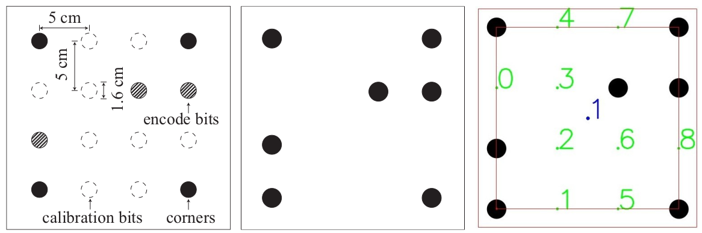
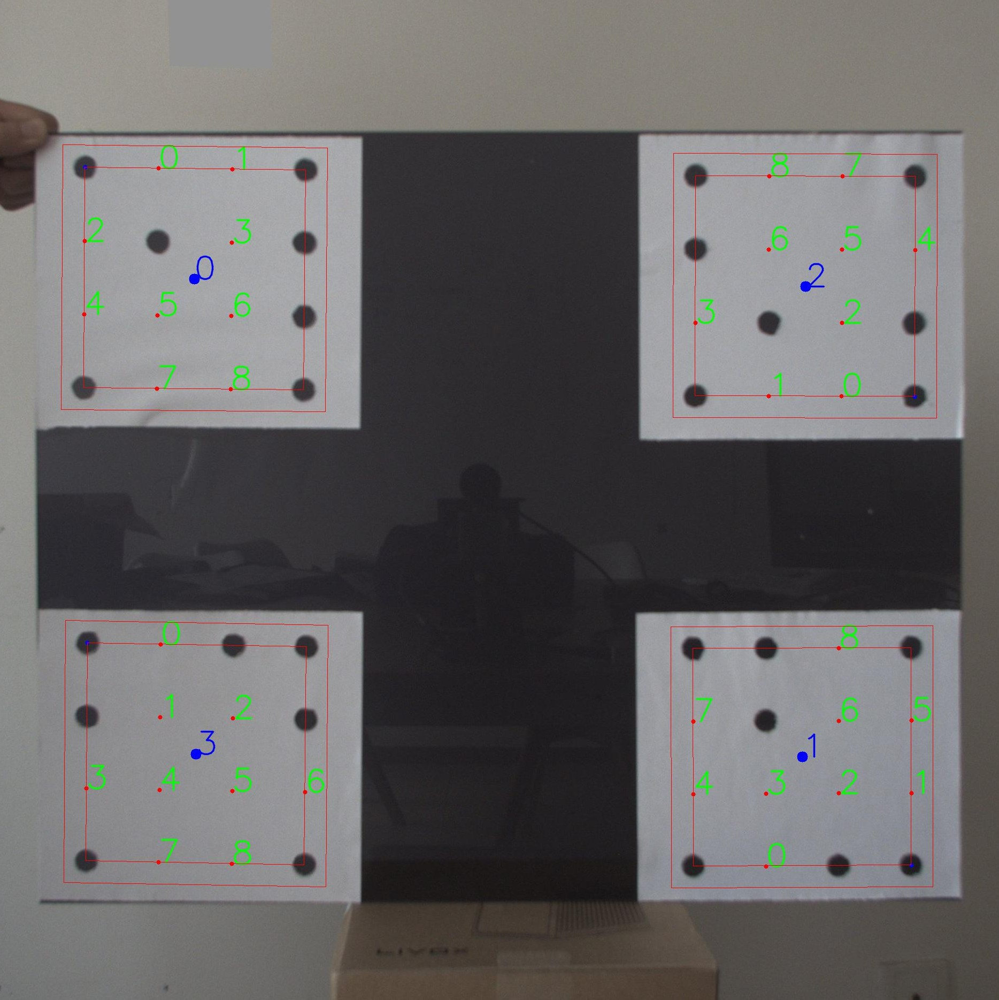
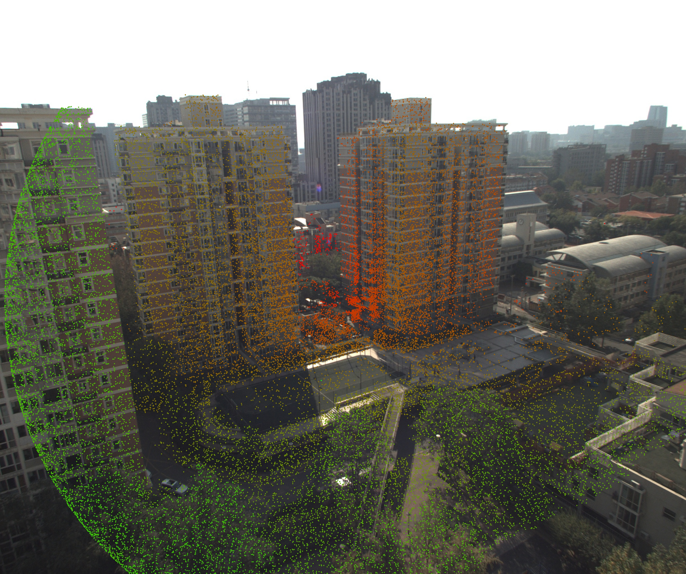
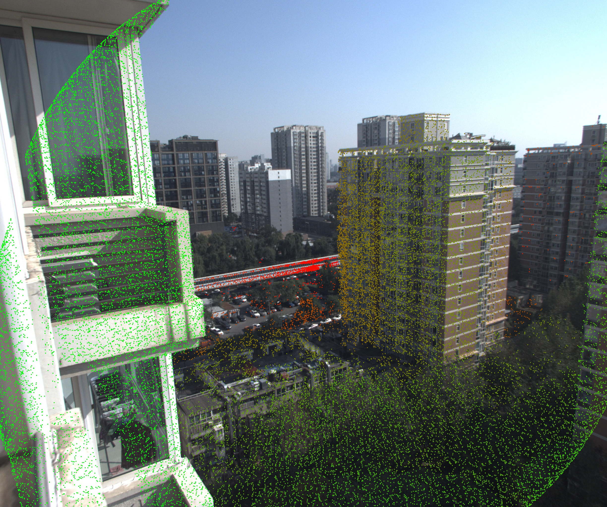
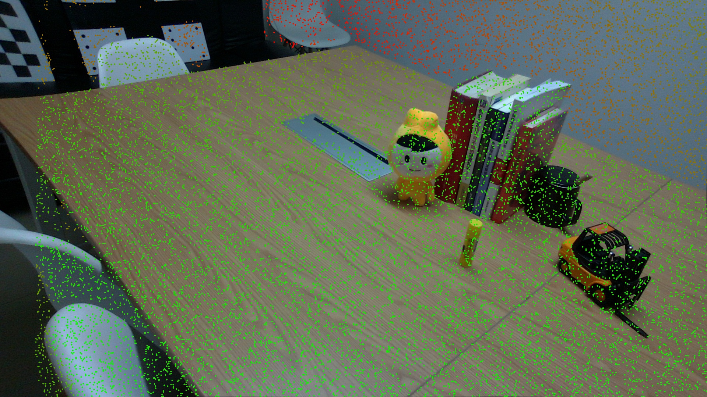
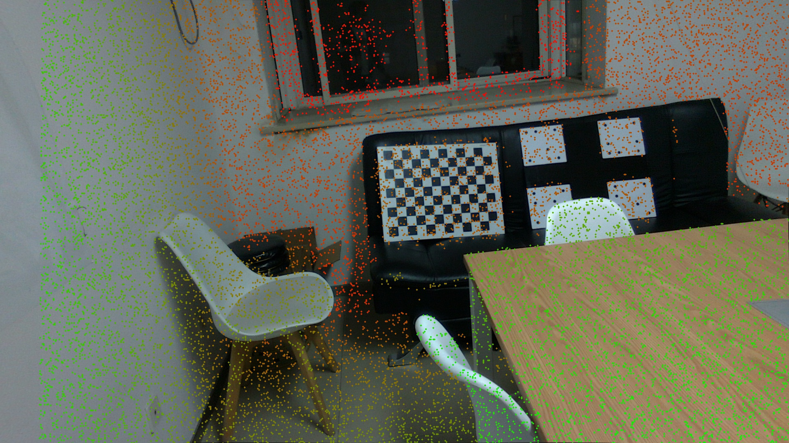
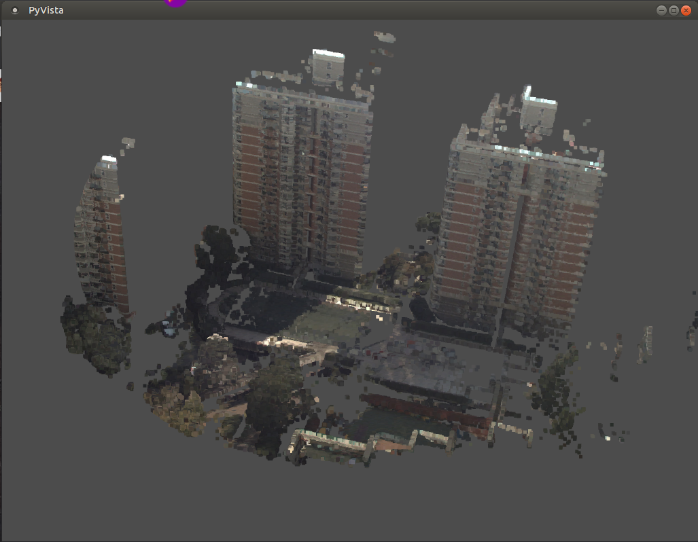
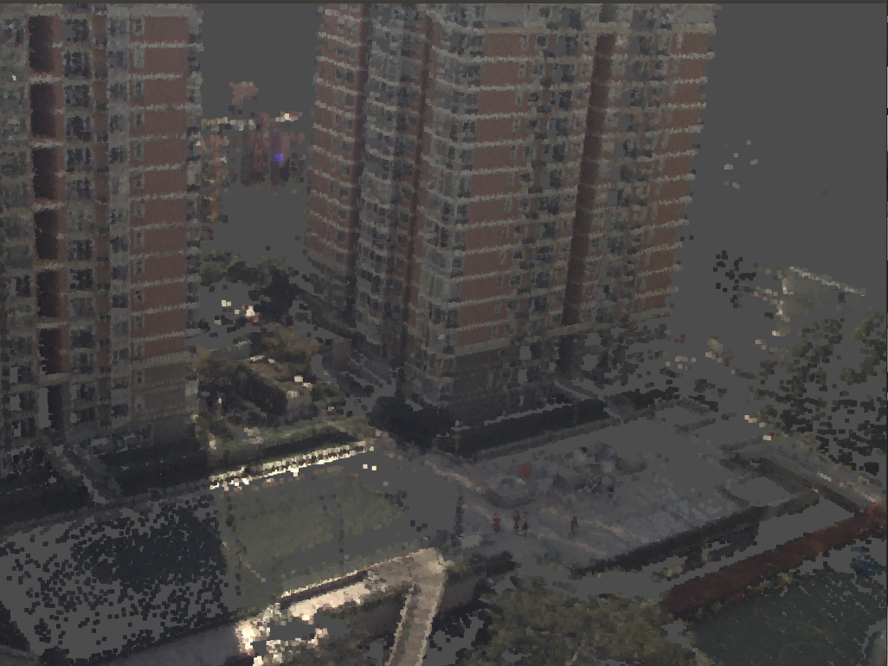
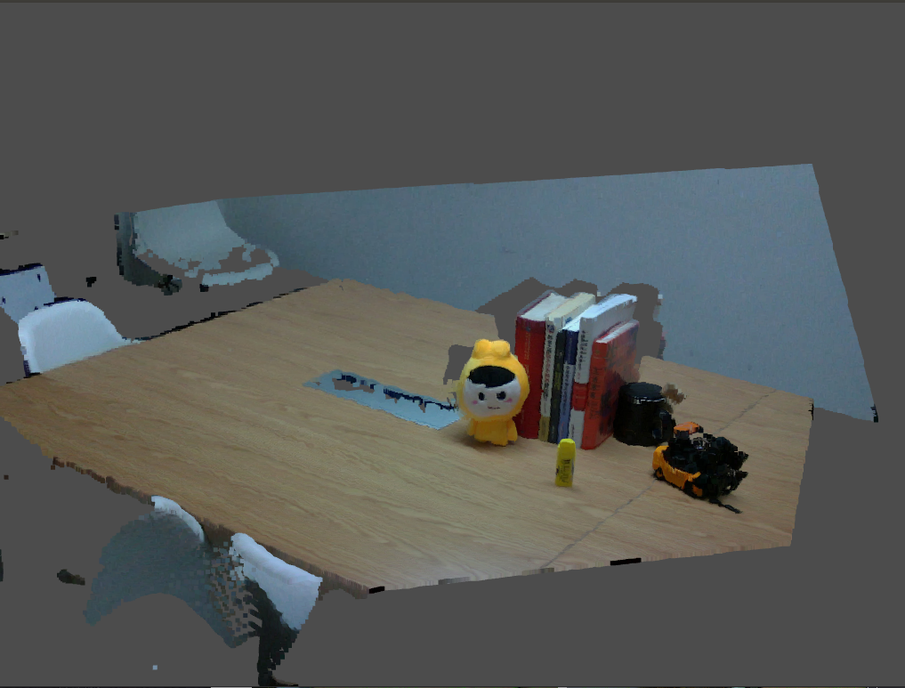
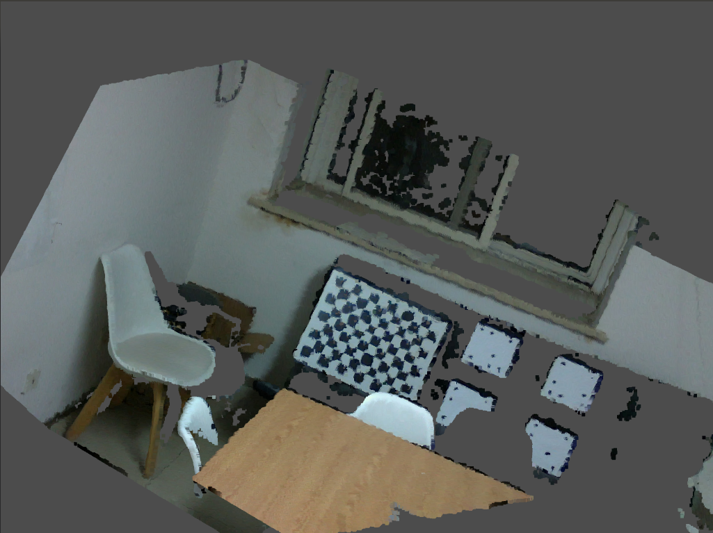

# A4LidarTag

A close-range target-based calibration framework for solid-state lidar (SSL) and camera

    
    

## Environment

~~~bash
conda install --file conda_pkgs.txt
~~~

## Marker Generation

M1 : pdf

M2 : [generation (optional)](https://github.com/xieyuser/A4LidarTag-Generation)

## Calibration

### Data preparation

rgb images: *\*.jpg*

point cloud : *\*.npy*

demo data is shown in [./data](https://drive.google.com/file/d/1_tPclW5FZDyhnbwiCSwIEKzGhOhUmXSM/view?usp=sharing)

unzip it to ./data, finally file tree:

~~~bash
data
	--data_livox
	--data-l515
	--data_livox_verify
	--data_l515_verify
~~~

### How to use

~~~bash
python tools/calibrate_camera_{device}.py  # device: e.g. Livox, L515
Options:
  --calib-config                           # path of calibration config
  --mono-calib                             # path of monocular images
  --pattern-dic                            # path of marker dictionary
  --out-f                                  # path of calibration result to save
  --verify-dir                             # path of check images
~~~

### Visualization

~~~bash
# reproject
python tools/reproject.py
Options:
  --device                                 # reproject device type
  --img_dir                                # path of monocular images
  --pc_dir                                 # path of point cloud
  --rectified_img_dir                      # path of rectified image dir
  --reproject                              # path of reproject result
~~~

Livox

    
    

L515

    
    

~~~bash

# render
python tools/rectify.py
Options:
  --device                                 # reproject device type
  --img_dir                                # path of monocular images
  --pc_dir                                 # path of point cloud
  --rectified_img_dir                      # path of rectified image dir
  --rectified_pc                           # path of rectified result
~~~

Livox

    
    

L515

    
    

